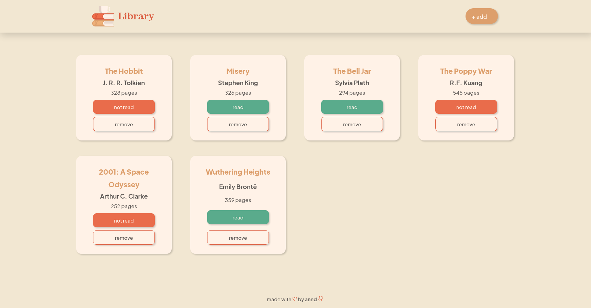

# Library

A **"Library"** page project from _**The Odin Project**_ curriculum.

## About the Project:
A bookshelf page project where you can add books and set their status as to "read" or "not read". The project was made to practice what I learned about _Objects_.

## Features:
 * Modal card to add books
 * Toggle button to change read status
 * Remove button to delete book card
 * Responsive cards

 ## Resources:
 * [Logo image](https://br.freepik.com/icone/livro_695856#fromView=search&term=autumn+books&page=47&position=23)
 * [Fonts](https://www.fontshare.com/)
 * [Icons](https://phosphoricons.com/)
 * [Add button animation](https://uiverse.io/vinodjangid07/curvy-lionfish-94)
 * [Checkbox code](https://moderncss.dev/pure-css-custom-checkbox-style/)

## Visit the Project:
Check out the [_**project**_](https://anndcodes.github.io/library/) out!

---

Made with ❤️ by [**Annd**](https://github.com/anndcodes)